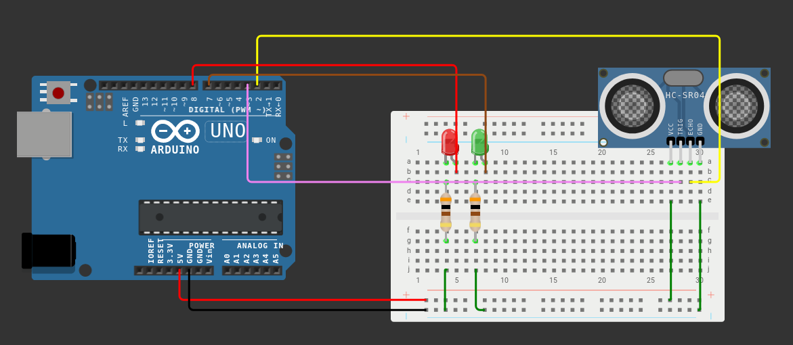

# Projeto de extensão - Robótica educacional - Univates

Esse repositório contém o código que foi utilizando no vídeo sobre Arduino e Sensores. [Vídeo](https://www.youtube.com/channel/UCTlPBASwM2ZRvR5VivHdctg)

## Componentes e materiais

- 01 (um) Arduino Uno
- 01 (um) cabo USB (para conectar o Arduino ao computador)
- 02 (dois) leds (de preferência de duas cores diferentes)
- 01 (uma) protoboard
- 02 (dois) resistores de 300 ohms
- 10 (dez) jumpers macho macho
- 01 (um) sensor ultrassônico

## Circuito

## Código
Você pode ver o código utilizado clicando [aqui.](https://github.com/mateusroveda/robotica_arduino/blob/master/sketch_sensorproximidade.ino)

## Links úteis
- [Univates](https://www.univates.br/)
- [Canal do projeto](https://www.youtube.com/channel/UCTlPBASwM2ZRvR5VivHdctg)
- [Página do projeto](https://www.univates.br/extensao/projetos-de-extensao/robotica-educacional)
- [Roveeb](https://www.youtube.com/roveeb)
